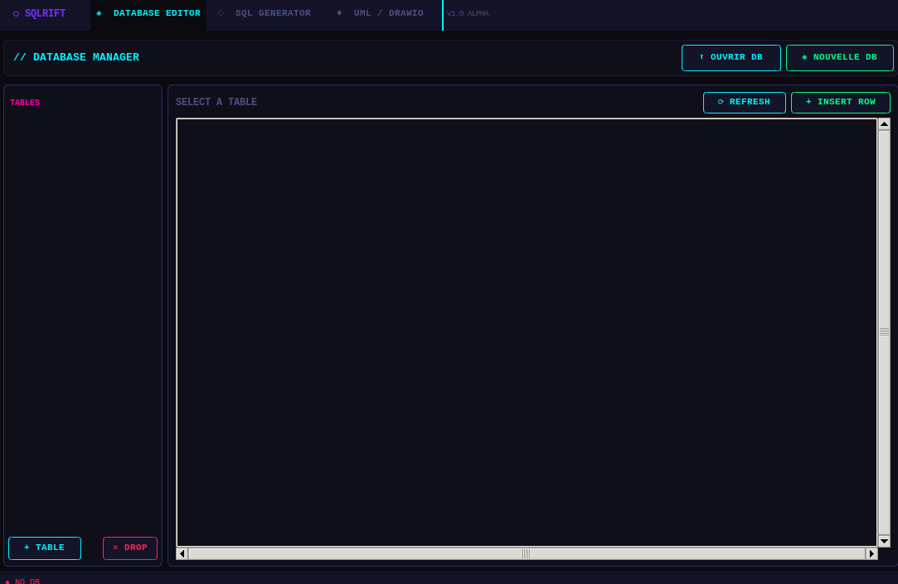

# ⬡ SQLRIFT — Database Manager

> **Modern SQLite GUI** — glitch/liminal RGB palette, terminal vibes, zero cloud dependency.


---

```
╔══════════════════════════════════════════════════════╗
║ ⬡ SQLRIFT  ◈ DATABASE EDITOR  ◇ SQL GENERATOR ◆ UML  ║
╠══════════════════════════════════════════════════════╣
║  ● mydb.db          ✓ Table created                  ║
╚══════════════════════════════════════════════════════╝
```

## Overview

SQLRIFT is a **100% local** SQLite database manager, built with a **glitch / liminal RGB** aesthetic: near-black background, neon accents — cyan `#00f5ff`, magenta `#ff00aa`, green `#00ff88` — and `Courier New` monospace typography blending 90s terminal energy with a futuristic interface.


---

## Features

### ◈ Database Editor Tab
- Create a new `.db` database file
- Open an existing SQLite database
- List all tables in a side panel
- Create a table via a dedicated dialog: name, columns, types, PRIMARY KEY, NOT NULL, DEFAULT
- Drop a table after confirmation
- Display table rows in a Treeview with horizontal/vertical scrolling
- Insert a row via a form dynamically generated from the table's columns

### ◇ SQL Generator Tab
- Raw SQL text editor (multiple queries separated by `;`)
- Auto-generate the full DDL schema of the open database
- Execute queries and display formatted results in an output panel
- Export the editor contents as a `.sql` file

### ◆ UML / Drawio Tab *(implemented, ready to extend)*
- Generate a `.drawio` file with tables and columns in draw.io XML format
- Preview the XML directly in the interface
- Export the `.drawio` file ready to open in [diagrams.net](https://app.diagrams.net/)

### Extras
- **Glitch effect** on the title: a background thread randomly replaces characters with ASCII noise (`█▓▒░!@#$`) at irregular intervals
- **Persistent status bar**: active DB name, color-coded success/error messages, table/row counters
- **Reusable custom widgets**: `NeonButton`, `ScanlineFrame`, `GlitchLabel`

---

## Installation

```bash
# 1. Clone the repo
git clone https://github.com/your-username/sqlrift.git
cd sqlrift

# 2. Install dependencies
pip install customtkinter

# 3. Run the app
python db_manager.py
```

**Requirements:** Python 3.10+, tkinter (bundled with Python on Windows/macOS — on Linux: `sudo apt install python3-tk`)

---

## Color Palette

| Role | Hex | Preview |
|------|-----|---------|
| Main background | `#0a0a0f` | ⬛ |
| Secondary background | `#0f0f1a` | ⬛ |
| Cyan (primary accent) | `#00f5ff` | 🟦 |
| Magenta (secondary accent) | `#ff00aa` | 🟣 |
| Green (success) | `#00ff88` | 🟩 |
| Yellow (warning) | `#ffee00` | 🟨 |
| Red (error) | `#ff2255` | 🟥 |
| Purple (selection) | `#7b2fff` | 🟣 |
| Orange (XML preview) | `#ff6b35` | 🟧 |
| Normal text | `#c8d8ff` | ⬜ |

---

## Roadmap

- [ ] Inline cell editing in the Treeview
- [ ] Delete selected rows
- [ ] Rename tables/columns (ALTER TABLE)
- [ ] Search/filter rows
- [ ] CSV → table import
- [ ] Export table as CSV
- [ ] Visual UML schema preview inside the app (canvas)
- [ ] SQL syntax highlighting in the editor
- [ ] Alternative themes (light mode, purple palette, amber palette)
- [ ] SQL query history

---

## Screens




---

## License

MIT — Do whatever you want with it, credit appreciated.

Developed with the assistance of Claude (Anthropic).

---

*Built with 🟦 CustomTkinter + SQLite — No cloud, no telemetry, just your data.*
